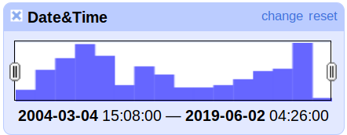
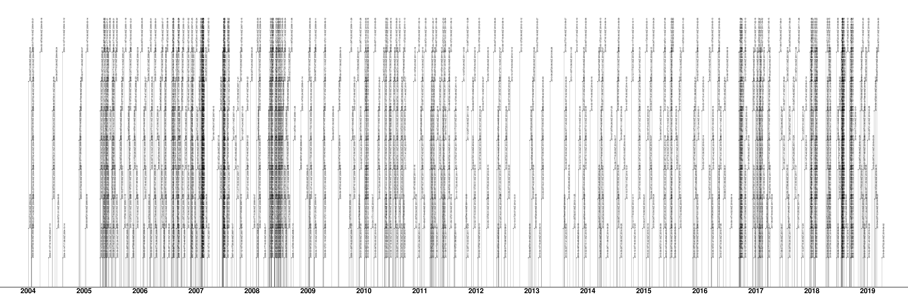
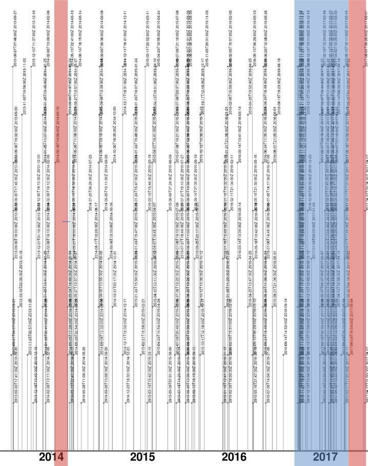

## 03 Versionsverlauf des Lemmas "Populismus"

Um einen Ablgeich mit dem Referenzzeitraum zu ermöglichen, muss zunächst der Versionsverlauf des Lemmas visualisiert werden. Es ist anzunehmen, dass sich im Versionsverlauf ähnliche Muster zeigen werden, wie sie in der Wortverlaufskurve im [Abschnitt 02](/02_Referenzzeitraum/) deutlich wurden. Im Gegensatz zur Analyse des Wortverlaufs soll hier jedoch die Bearbeitungshäufigkeit dargestellt werden. Dabei ist anzunehmen, dass Phasen mit einer hohen Bearbeitungshäufigkeit durch ein gesteigertes öffentliches Interesse und einen intensivierten Diskurs um den Begriff selbst hervorgerufen werden.

### OpenRefine - Timeline Facet

 

Diese aus OpenRefine erzeugte Kurzübersicht vermittelt einen ersten Eindruck von der Verteilung der Edit-Häufigkeit über den betrachteten Zeitraum hinweg. Diese Visualisierung der Werte ist jedoch stark vereinfacht und vermittelt deshalb möglicherweise einen falschen Eindruck. Solche Diagramme fassen die einzelnen Datumswerte in definierten Zeiträumen (*buckets*) zusammen, sodass die Höhe der einzelnen Balken die Anzahl der darin subsumierten Daten darstellt. Ohne genaue Kenntnis über die Definition dieser Zeiträume und der exakten Werte lässt sich somit keine vernünftige Auswertung der Verteilung der Edits durchführen.

Für den höchst möglichen Detailgrad müsste jeder einzelne Versionssprung als eigener Wert auf einer Zeitachse eingetragen werden. Werthäufungen entsprächen dort Zeiträumen mit hoher Änderungsaktivität, Bereiche mit wenigen Werten hingegen Zeiträumen mit geringer Änderungsaktivität. Unserer oben definierten These folgend, entsprächen diese Zeiträume somit einem hohen bzw. niedrigem öffentlichen Interesse.

### timeline plot mit R

Die Visualisierung eines derartigen Diagramms wurde in der Sprache *R* (RStudio in Version 1.2.1335 unter Lubuntu 18.04) mit Hilfe des Plugins [*timelineS in der Version 0.1.1.*](https://www.rdocumentation.org/packages/timelineS/versions/0.1.1) implementiert. Der kommentierte Quellcode dazu befindet sich im Unterordner [R_timeline_plot](R_timeline_plot). Als Werte werden die genauen Timestamps der einzelnen Versionen angegeben. Die Label variieren in Ihrer Höhe, um eine bessere Lesbarkeit zu gewährleisten. Als Datenbasis dient der auf das Datum reduzierte [Export der Arbeitsdaten](/01_Quelldaten/20190627_Arbeitsdaten_Populismus_nurDatum.csv) mit allen 1045 Einträgen.

Im Vergleich zur eingangs verwendeten Grafik lassen sich an diesem Plot Zeiträume mit hoher und niedriger Aktivität exakt bestimmen und abgrenzen. Jeder Eintrag ist, unter Verwendung einer entsprechenden Vergrößerungsstufe, anhand des sekundengenauen Timestamps eindeutig zu bestimmen. Gleichwohl deckt sich der Verlauf in etwa mit der Kurzübersicht. Die Häufung im ersten Drittel findet sich ebenso wieder, wie der aktivitätsarme Bereich im dritten Viertel und der Anstieg am Ende.

### Abgleich mit Referenzzeitraum

Im direkten Vergleich der Wortverlaufskurve aus [Abschnitt 02](/02_Referenzzeitraum/) mit dem Versionsverlauf lassen sich leicht Parallelen ziehen.

Zwischen 2012 und 2014 ist in beiden Darstellungen eine Phase geringer Aktivität zu erkennen. Dem folgt eine Phase ansteigender Aktivität, die bis etwa 2017 anhält und anschließend relativ stabil bleibt. Die Teilung der Wortverlaufsstatistik in Jahre erschwert hier die detaillierte Auswertung, da diese Häufungen, wie z.B. um den Jahreswechsel 2016 auf 2017, nicht abbilden kann.

#### Detaillierung und Begrenzung

Dieser Ausschnitt zeigt den ermittelten Bereich von 2014 bis Frühjahr 2017.

Den Beginn des Betrachtungszeitraumes markiert die Version vom [2014-03-16T14:09:00Z mit der ID 128563967](https://de.wikipedia.org/w/index.php?title=Populismus&oldid=128563967). (Ab hier [V2014](/03_Versionsverlauf/Populismus_V2014.html) genannt.) Diese Version beschreibt das Ende einer Phase mit geringer Bearbeitungsdichte. Weiterhin wurden in den Versionen keine substantiellen Änderungen vorgenommen.
Als Vergleichsversion dient [2017-06-04T18:04:00Z mit der ID 166083456](https://de.wikipedia.org/w/index.php?title=Populismus&oldid=166083456). (Ab hier [V2017](/03_Versionsverlauf/Populismus_V2017.html).) Sie markiert die letzte Änderung in der Hochphase von Ende 2016 bis Anfang 2017. Weiterhin folgen auf sie zunächst erneut nur kleine Änderungen. 

Der Textvergleich dieser beiden Versionen kann über die Wikipedia Revisionskontrolle vorgenommen werden. Die Adressierung der Versionen erfolgt dabei über eine generierte URL anhand der IDs in der Form:
`https://de.wikipedia.org/w/index.php?title=Populismus&oldid=128563967` für V2014.
`https://de.wikipedia.org/w/index.php?title=Populismus&oldid=166083456` für V2017.
