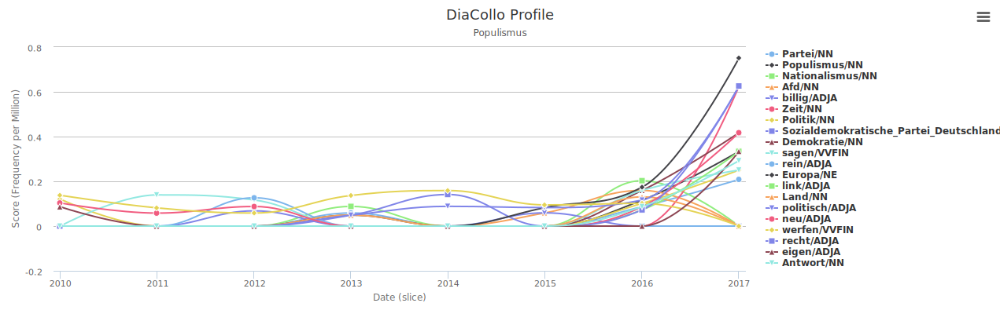

## 04 Ermittlung von Referenzkollokationen

Innerhalb des definierten Zeitraumes sollen nun Änderungen in der Begriffsdefinition überprüft werden. Hierzu wird zunächst wieder ein Abgleich mit einem Leitmedium, erneut der ZEIT Korpus, benötigt. Anhand der Änderung von Begriffspaarungen vor und innerhalb unseres betrachteten Zeitraumes lassen sich Entwicklungen in der medialen Diskussion dokumentieren, auf die anschließend das Lemma geprüft werden soll.

Neben der Dokumentation der Begriffsänderung bzw. der öffentlichen Debatte, lassen sich mit dieser Methodik zwei mögliche Effekte belegen:
1. Eine weitgehende Übernahme der sich verändernden Kollokationen vom ZEIT-Korpus in das Lemma würde auf einen direkten Einfluss der medialen Debatte auf die allgemeingültige Begriffsdefinition in der Wikipedia hindeuten.
2. Eine ausbleibende Übernahme der Änderungen hingegen würde auf eine Trennung der beiden medialen Sphären hindeuten. In diesem Falle würde sich die Begriffsdefinition in der Wikipedia augenscheinlich losgelöst von einer übergeordneten medialen Debatte entwickeln.

### Überblick via Highchart
Die Kollokationskurve kann unter folgender [URL](https://kaskade.dwds.de/dstar/zeit/diacollo/?query=Populismus&_s=submit&date=2010%3A2017&slice=1&score=fm&kbest=20&cutoff=&profile=2&format=hichart&global=1&groupby=&eps=0) generiert werden: `https://kaskade.dwds.de/dstar/zeit/diacollo/?query=Populismus&_s=submit&date=2010%3A2017&slice=1&score=fm&kbest=20&cutoff=&profile=2&format=hichart&global=1&groupby=&eps=0`

An dieser Grafik lassen sich bereits erste Entwicklungen ablesen, für eine detaillierte Auswertung ist diese jedoch nicht detailliert genug.

### Parameter
Eine Abfrage mit simpler Textausgabe ist unter folgender [URL](https://kaskade.dwds.de/dstar/zeit/diacollo/?query=Populismus&_s=submit&date=2014%3A2017&slice=1&score=fm&kbest=20&cutoff=&profile=2&format=text&groupby=&eps=0) erreichbar: `https://kaskade.dwds.de/dstar/zeit/diacollo/?query=Populismus&_s=submit&date=2010%3A2017&slice=1&score=fm&kbest=20&cutoff=&profile=2&format=text&groupby=&eps=0`

Die Suchparameter sind bereits in der URL codiert, sodass eine erneute Abfrage dieser URL das gleiche Ergebnis liefern sollte. (Sofern sich der Zustand des Korpus nicht geändert hat. Siehe [Korpuseigenschaften.md](/02_Referenzzeitraum/Korpuseigenschaften.md)) Eine detaillierte Dokumentation aller Parameter und Werte findet sich auf der zugehörigen [Hilfeseite](https://kaskade.dwds.de/dstar/zeit/diacollo/help.perl) des DWDS. Ein umfangreiches [Tutorial](https://kaskade.dwds.de/diacollo-tutorial/) bietet zusätzliche Hilfe im Umgang mit DiaCollo.

- `query=Populismus` Definition des Suchbegriffs.
- `date=2014%3A2017` Zu untersuchender Zeitraum: 2010 bis 2017. Wie bereits bei der Ermittlung des Referenzzeitraums beginnt die Analyse vier Jahre vor Beginn des zu betrachteten Zeitraumes. Dadurch sollen Fehlschlüsse vermieden werden, da stabile Paarungen und kurzfristige Entwicklungen leichter voneinander unterschieden werden können.
- `slice=1` Größe der betrachteten Zeiträume. Für die feinst mögliche Auflösung wurde der niedrigste Wert, 1 Jahr, gewählt.
- `score=fm` Methode zur Ermittlung der Kollokationen: Frequenz pro Millionen. Es handelt sich hierbei um eine linear normalisierte Version der Rohdaten. Im Gegensatz zu komplexeren Argorithmen wie der *scaled log-dice coefficient* oder die *binomal log likelyhood ratio* werden hier auch statistische Ausreißer ins Ergebnis mit aufgenommen. Vorteil der verwedeten simplen Methode ist, dass die Ergebnisse problemlos nachvollziehbar sind, während eventuelle Ausreißer in folgenden manuellen Auswertung bereinigt werden können.
- `kbest=20` Anzahl der Elemente je Zeitraum. Standard ist 10. Durch die Erhöhung auf 20 Elemente soll sichergestellt werden, dass trotz der fehlenden Filterung "kleiner" Wörter keine relevanten Begriffe ausgeschlossen werden.
- `profile=2` Profil: Kollokationen, das Standardprofil für DiaCollo.
- `format=text` Das Textformat ist tabulatorsepariert und eigenet sich zur Überführung in andere Programme und Formate. Die o.g. Verlaufskurve wird durch das Format `highchart`, eine Javascript Bibliothek zur Erzeugung interaktiver Kurven, angelegt.
- `global=` `0` für Textausgabe, `1` für Highchart. Ist dieser Parameter positiv, werden sämtliche Kollokationen für jeden Zeitraum vermerkt. In Abschnitten, in denen eine bestimmte Kollokation eigentlich nicht vorkommt, wird diese mit der Frequenz f12 = 0 notiert. Dieses Vorgehen ist nützlich für die Anzeige von Verlaufsgrafiken wie der Highchart. In der Textausgabe, die Grundlage für die folgenden Auswertungen ist, würde dies die Ergebnissmenge nur unnötig vergrößern.

Der Ergebnissatz ist in der Datei [populismus_2010-2017_kollokation.tsv](populismus_2010-2017_kollokation.tsv) abgelegt.

---

### Methodische Erkenntnisse
Die umfangreichen Konfigurationsmöglichkeiten bieten zwar eine hohe Anpassbarkeit, verlangen jedoch gleichzeitig eine intensive Beschäftigung mit den verschiedenen Algorithmen. Der nutzerfreundliche Ersteindruck der Oberfläche - man gibt den Suchbegriff ein, drückt auf **submit** und erhält sofort eine Auswertung - entkoppelt von der Komplexität der durchgeführten Analyse. Die Dokumentation ist zwar durchaus hilfreich, jedoch reicht sie nicht für eine fundierte Bewertung der zur Verfügung stehenden Parameter und Algorithmen, sowie deren Auswirkungen auf das Ergebnis und folglich Implikationen für die weitere Arbeit mit den Daten.
