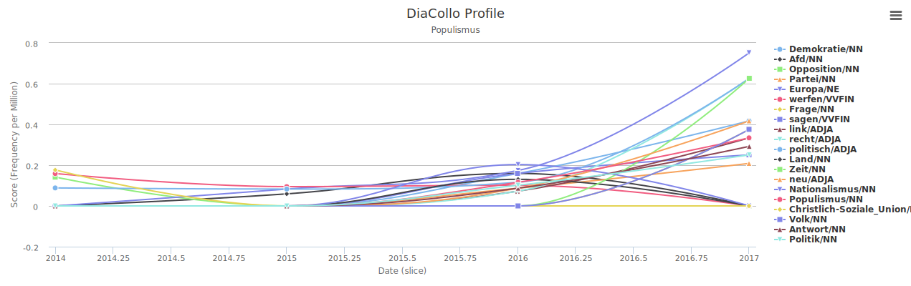

## 04 Ermittlung von Referenzkollokationen

Innerhalb des definierten Zeitraumes sollen nun Änderungen in der Begriffsdefinition überprüft werden. Hierzu wird zunächst wieder ein Abgleich mit einem Leitmedium, erneut der ZEIT Korpus, benötigt. Anhand der Änderung von Begriffspaarungen vor und innerhalb unseres betrachteten Zeitraumes lassen sich Entwicklungen in der medialen Diskussion dokumentieren, auf die anschließend das Lemma geprüft werden soll.

Neben der Dokumentation der Begriffsänderung bzw. der öffentlichen Debatte, lassen sich mit dieser Methodik zwei mögliche Effekte belegen:
1. Eine weitgehende Übernahme der sich verändernden Kollokationen vom ZEIT-Korpus in das Lemma würde auf einen direkten Einfluss der medialen Debatte auf die allgemeingültige Begriffsdefinition in der Wikipedia hindeuten.
2. Eine ausbleibende Übernahme der Änderungen hingegen würde auf eine Trennung der beiden medialen Sphären hindeuten. In diesem Falle würde sich die Begriffsdefinition in der Wikipedia augenscheinlich losgelöst von einer übergeordneten medialen Debatte entwickeln.

### Überblick via Highchart
Die Kollokationskurve kann unter folgender [URL](http://kaskade.dwds.de/dstar/zeit/diacollo/?query=Populismus&_s=submit&date=2014%3A2017&slice=1&score=fm&kbest=20&cutoff=&profile=2&format=hichart&global=1&groupby=&eps=0) generiert werden: `http://kaskade.dwds.de/dstar/zeit/diacollo/?query=Populismus&_s=submit&date=2014%3A2017&slice=1&score=fm&kbest=20&cutoff=&profile=2&format=hichart&global=1&groupby=&eps=0`

### Parameter
Eine Abfrage mit simpler Textausgabe ist unter folgender [URL](http://kaskade.dwds.de/dstar/zeit/diacollo/profile.perl?format=text&profile=2&slice=1&date=2014%3A2017&eps=0&query=Populismus&diff=adiff&score=fm&kbest=20) erreichbar: `http://kaskade.dwds.de/dstar/zeit/diacollo/profile.perl?format=text&profile=2&slice=1&date=2014%3A2017&eps=0&query=Populismus&diff=adiff&score=fm&kbest=20`

Die Suchparameter sind bereits in der URL codiert, sodass eine erneute Abfrage dieser URL das gleiche Ergebnis liefern müsste. (Sofern sich der Zustand des Korpus nicht geändert hat. Siehe [02_Referenzzeitraum/Korpuseigenschaften.md](/02_Referenzzeitraum/Korpuseigenschaften.md)) Eine detaillierte Dokumentation aller Parameter und Werte findet sich auf der zugehörigen [Hilfeseite](https://kaskade.dwds.de/dstar/zeit/diacollo/help.perl) des DWDS. Ein umfangreiches [Tutorial](https://kaskade.dwds.de/diacollo-tutorial/) bietet zusätzliche Hilfe im Umgang mit DiaCollo.

- `format=text` Das Textformat ist tabulatorsepariert und eigenet sich zur Überführung in andere Programme und Formate. Die o.g. Verlaufskurve wird durch das Format "Highchart", eine Javascript Bibliothek zur Erzeugung interaktiver Kurven, angelegt.
- `profile=2`
- `slice=1`
- `date=2014%3A2017`
- `eps=0`
- `query=Populismus`
- `diff=adiff`
- `score=fm`
- `kbest=20`

Der Ergebnissatz ist in der Datei [populismus_2014-2017_kollokation.tsv](populismus_2014-2017_kollokation.tsv) abgelegt.
