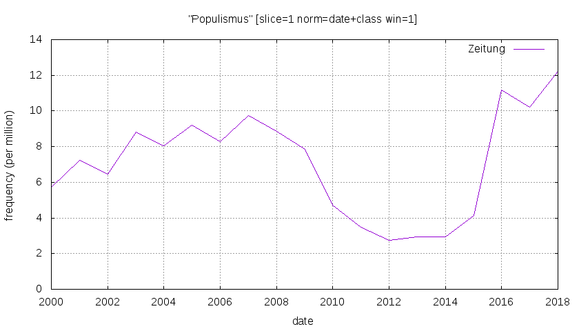

# Projektdokumentation

[**zum Repositorium (Github)**](https://github.com/krugbuild/wiki-pop-quelle/) | [**zur Leseansicht (Github Pages)**](https://krugbuild.github.io/wiki-pop-quelle/)

*work in progress*

[Abschnitt "Quellenarbeit"](./README.md#Quellenarbeit)

[Abschnitt "Auswertung"](./README.md#Auswertung)

---

Die [Versionsgeschichte](https://de.wikipedia.org/wiki/Hilfe:Versionen) ist eines der zentralen Werkzeuge zur Pflege der Wikipedia. In Ihr werden sämtliche Änderungen eines Artikels mit Zeitpunkt und Autor vermerkt. Neben Manipulationsversuchen[^1] kann so theoretisch die gesamte Entwicklung eines Artikels nachverfolgt werden. Die gesamte Begriffsgeschichte, wenn man so will. Da die Versionsgeschichte vieler Begriffe bis in die frühen 2000er Jahre reicht, sollte sie eine reiche Quelle für verschiedene Methoden und Fragestellungen der zeit- und begriffsgeschichtlichen Forschung sein. Diese These zu überprüfen ist das Kernanliegen dieses Projekts.

[^1]: Siehe z.B.: https://www.heise.de/newsticker/meldung/Fall-Relotius-Manipulationen-im-Wikipedia-Artikel-4582927.html .

Der Umgang mit diesen *digital born* Daten[^2] verlangt natürlich nach einer gesonderten quellenkundlichen Behandlung,  #anspruch #herausforderung

[^2]: Vgl. Rehbein, Malte: Geschichtsforschung im digitalen Raum. Über die Notwendigkeit der Digital Humanities als historische Grund- und Transferwissenschaft., in: Herbers, Klaus; Trenkle, Viktoria (Hg.): Papstgeschichte im digitalen Zeitalter: neue Zugangsweisen zu einer Kulturgeschichte Europas, Köln; Weimar; Wien 2018 (Beihefte zum Archiv für Kulturgeschichte BV023554989 Heft 85), S. 41f.

## Quellenarbeit

Kern dieses Projektes ist die Auseinandersetzung mit dem Quellenmaterial und der Exploration digitalhistorischer Methoden zum Umgang mit demselben. Um den Projektverlauf möglichst nachvollziehbar zu gestalten, werden im Folgenden die verschiedenen Stufen der Quellenarbeit (die sich in der Struktur des Repositoriums widerspiegeln) kurz umrissen. Diese komprimierte Darstellung kann die eigentliche Dokumentation der Quellenarbeit nur ergänzen, keinesfalls jedoch ersetzen. Die Überschriften dienen als Verweis zu den jeweiligen Unterordnern.

### [01 Aufbereitung der Quelldaten](./01_Quelldaten/)

Da die Informationen zur Versionsgeschichte zur besseren Lesbarkeit in einer HTML-Struktur eingebettet sind, müssen diese zunächst in Reinform gebracht werden. Denn nur so wird eine Weiterverarbeitung überhaupt erst möglich. Das Ergebnis dieser Datenaufbereitung ist eine [Tabelle](./01_Quelldaten/20190627_Arbeitsdaten_Populismus_vollstaendig.csv), in der alle 1045 Versionen des Lemmas *Populismus* zwischen dem 02. Juni 2019 und dem 04. März 2004, dem Tag der Erstellung dieses Artikels, mit Datum, verantwortlichem Benutzer, Kommentar und weiteren, technischen Details verzeichnet sind.

### [02 Referenzzeitraum](./02_Referenzzeitraum/)

Um einen Abgleich mit dem öffentlichen Diskurs zu ermöglichen, muss ein Referenzzeitraum bestimmt werden. Der Konjunkturzyklus eines Begriffes kann zum Beispiel über die Wortverlaufskurve innerhalb eines gesellschaftlich relevanten Textkorpus nachvollzogen werden. Als Grundlage für dieses Projekt wurde der Korpus der Wochenzeitschrift DIE ZEIT gewählt, welche zu den deutschen Leitmedien gezählt wird.[^3] 

Dieser Verlauf vermittelt einen Eindruck der medialen Aufmerksam für das Thema *Populismus* seit Erstellung des zugehörigen Lemmas in der Wikipedia. Zwischen 2014 und 2016/2017 zeigt sich hier ein starker Anstieg, dessen Auswirkung auf die Begriffsbestimmung im Folgenden untersucht werden soll - und somit den Referenzzeitraum definiert.

[^3]:  Vgl. [Weischenberg, Von Siegfried; Malik, Maja; Scholl, Armin: Journalismus in Deutschland 2005. Zentrale Befunde der aktuellen Repräsentativbefragung deutscher Journalisten, in: Media Perspektiven 7, 2006, S. 359](https://www.ard-werbung.de/fileadmin/user_upload/media-perspektiven/pdf/2006/07-2006_Weischenberg.pdf).

### [03 Versionsverlauf](./03_Versionsverlauf/)

Um die konjunkturelle Entwicklung des Lemmas mit der öffentlichen Berichterstattung vergleichen zu können, hilft es, die im [1. Abschnitt](./01_Quelldaten/) erhobenen Daten zu visualisieren. Die tabellarische Notation suggeriert möglicherweise eine zeitliche Gleichverteilung der einzelnen Versionen, weshalb diese stattdessen auf einem Zeitstrahl angeordnet dargestellt werden.

Dieser Plot zeigt den zuvor ermittelten Referenzzeitraum. Dargestellt ist jeder einzelne Versionssprung des Lemmas durch den zugehörigen *timestamp*. Es lassen sich Strukturen erkennen, die als Phasen hoher bzw. niedriger Bearbeitungsfrequenz identifiziert werden können. Zu Beginn und Ende des Untersuchungszeitraumes findet sich jeweils eine Phase mit geringer Bearbeitungsfrequenz (rot markiert). Die daraus entnommenen Grenzversionen bilden die Grundlage für die folgende begriffshistorische Analyse und werden fortan als [*V2014*](./03_Versionsverlauf/Populismus_V2014.html) und [*V2017*](./03_Versionsverlauf/Populismus_V2017.html) identifiziert und als lokale Kopie vorgehalten.

### [04 Referenzkollokationen](./04_Referenzkollokationen/) 

Zur Untersuchung einer möglichen Veränderung der Begriffsbedeutung orientieren wir uns erneut an einen Abgleich mit dem öffentlichen Diskurs. Hierzu werden mittels einer Kollokationsanalyse jene Begriffe ermittelt, die im Referenzzeitraum häufig in Verbindung mit dem Lemma auftreten. Die erzeugte [Liste](./04_Referenzkollokationen/populismus_2010-2017_kollokation.tsv) beinhaltet neben den ermittelten Kollokationen auch Informationen zu deren Frequenz und Wortart.

### [05 Abgleich](./05_Abgleich/)

Die Prüfung Verteilung der ermittelten Kollokationen in den Grenzversionen *V2014* und *V2017* bildet schlussendlich die Grundlage für die folgende Auswertung. Das Ergebnis ist eine [kommentierte Liste mit Wortverteilungen](./05_Abgleich/README.me) für beide Grenzversionen. 

Neben der Dokumentation der Begriffsänderung und der öffentlichen Debatte, lassen sich mit dieser Methodik Rückschlüsse auf den Einfluss der medialen Berichterstattung auf das Medium Wikipedia ziehen. Das Ergebnis wird vermutlich zwischen folgenden beiden Extrema eingeordnet werden müssen:

- Eine weitgehende Übernahme der sich verändernden Kollokationen vom ZEIT-Korpus in das Lemma würde auf einen **direkten Einfluss der medialen Debatte** auf die allgemeingültige Begriffsdefinition in der Wikipedia hindeuten.
- Eine ausbleibende Übernahme der Änderungen hingegen würde auf eine Trennung der beiden medialen Sphären hindeuten. In diesem Falle würde sich die Begriffsdefinition in der Wikipedia augenscheinlich **losgelöst von einer übergeordneten medialen** Debatte entwickeln.

## Auswertung

Um die Diskussion der [Ergebnissliste aus Abschnitt "05 Abgleich"](./05_Abgleich/README.md) zu strukturieren, werden die Begriffe zunächst in drei Gruppen gemäß Ihrer Worthäufigkeit innerhalb der Grenzversionen eingeteilt: 

1. kein Auftreten: `Antwort, CDU, CSU, Gabriel, Hollande, Not, Seehofer, SPD, Tsipras, vermeintlich, warnen`

2. weniger als zehn Treffer in *V2014* und *V2017*: `AfD, Aufstieg, billig, Demagogie, Europa, Frankreich, Grüne, Merkel, Opposition, Präsident, Vorwurf, Zeit, zunehmend`

3. mehr als zehn Treffer in in *V2014* oder *V2017*: `Demokratie, Deutschland, liberal, link, Nationalismus, Partei, Politik, recht, Volk`

-> Lemma ist weit weniger personengebunden. Für die damalige öffentliche Debatte zentrale Figuren wie Sigmar Gabriel, François Hollande, Horst Seehofer und Alexis Tsipras wurden weder in *V2014* noch in *V2017* erwähnt. Selbst Angela Merkel findet nur als beiläufiges Beispiel für den (neo)liberalen Populismus Einzug in *V2017*. 

