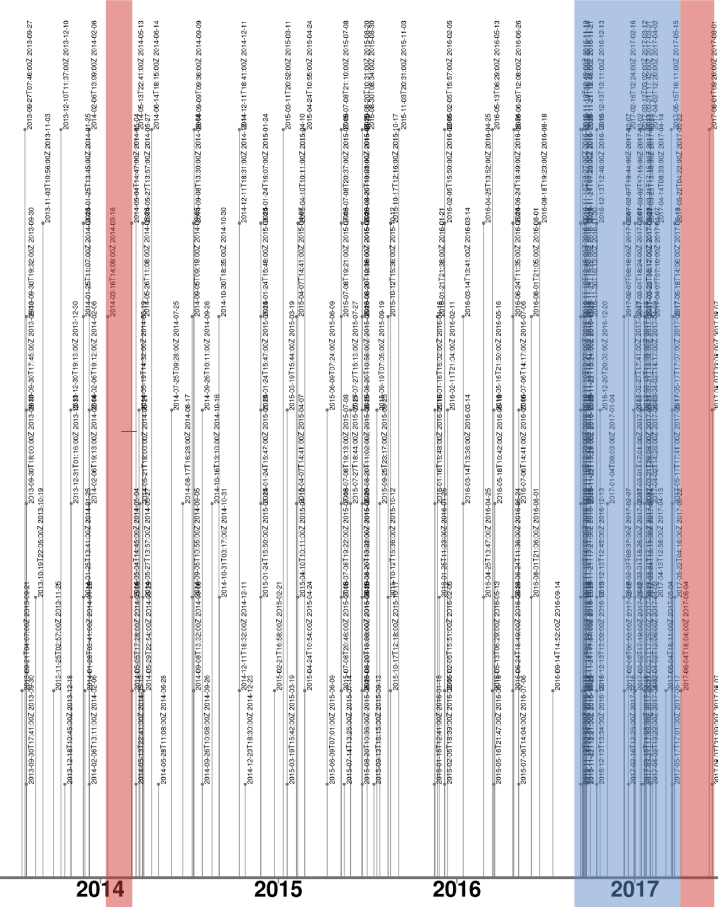

# Crowds, sources and manipulation

## Begriffshistorische Analysen mittels Wikipedia am Beispiel des Artikels "Populismus" zwischen 2014 und 2017.

[**zum Repositorium (Github)**](https://github.com/krugbuild/wiki-pop-quelle/) | [**zur Leseansicht (Github Pages)**](https://krugbuild.github.io/wiki-pop-quelle/)

Dieses Projekt ist als kommentiertes Forschungsdatenrepositorium zu verstehen, in dem Forschungsdaten, Dokumentation und Analyse im Verbund zur Verfügung gestellt werden. Es basiert auf einer [Vorstudie](./Vorstudie/), die im Juni und Juli 2019 im Rahmen einer Übung an der Humboldt-Universität zu Berlin durchgeführt wurde.

Stefan Krug, 18.11.2019.

---

Fragt man einen der weit verbreiteten virtuellen Assistenten wie Alexa, Cortana oder Siri nach einer Begriffsdefinition, dann stammt die Antwort mit hoher Wahrscheinlichkeit aus der Wikipedia.[^1] Ganz ähnlich verhält es sich bei der Suche nach einem beliebigen Stichwort mittels der gebräuchlichen Suchmaschinen. Der erste Treffer ist sicherlich der zugehörige Artikel in der Wikipedia, oder die Begriffsdefinition wird direkt neben den sonstigen Suchergebnissen als Seitenleiste eingeblendet. Die Bedeutung der Wikipedia als alltägliches Hilfsmittel ist wohl unbestritten - ihre Eignung als (historische) Quelle hingegen wird nur zögerlich überprüft.[^2] Dabei stellt uns Mediawiki, die eigentliche Software hinter Wikipedia, bereits einige hilfreiche Werkzeuge zur Auswertung bereit. Eine Kernfunktion des Mediawikis ist es, dass bei Korrekturen, Löschungen oder dem Hinzufügen neue Textabschnitte nicht einfach der bestehende Artikel überschrieben wird. Stattdessen wird für jede Änderung eine neue Version des Artikels erstellt. Dabei werden neben der eigentlichen Änderung insbesondere der Zeitpunkt der Änderung (üblicherweise als *timestamp* bezeichnet) und der Benutzername des Verantwortlichen gespeichert.  Diese [Versionsgeschichte](https://de.wikipedia.org/wiki/Hilfe:Versionen) wird zur Pflege der Wikipedia verwendet, zum Beispiel bei Manipulationsversuchen.[^3] Da diese Versionsgeschichte bei vielen Artikeln seit den frühen 2000ern anwächst und jeder Versionssprung präzise dokumentiert ist, eignet Sie sich vermutlich hervorragend als Ausgangspunkt einer begriffshistorischen Untersuchung. Den Quellenwert der Wikipedia unter diesem Gesichtspunkt an einem Beispiel zu bewerten sowie verschiedene methodische Zugänge zu prüfen ist das Kernanliegen dieses Projekts.

[^1]: Vgl. Naughton, John: Amazon’s Echo seems great, but what does it hear?, in: The Guardian, 15.01.2017. Online: <https://www.theguardian.com/commentisfree/2017/jan/15/amazon-echo-is-great-but-what-does-it-hear>, Stand: 18.11.2019.
[^2]: Vermehrt wird die Wikipedia zum Beispiel als Quelle für digitale Diskursanalysen verwendet. Zum Beispiel in *Gredel, Eva: Digital discourse analysis and Wikipedia: Bridging the gap between Foucauldian discourse analysis and digital conversation analysis, in: Journal of Pragmatics 115, 01.07.2017, S. 99–114. Online: <https://doi.org/10.1016/j.pragma.2017.02.010>* oder *Esteves Gonçalves da Costa, Bernardo; Cukierman, Henrique Luiz: How anthropogenic climate change prevailed: A case study of controversies around global warming on Portuguese Wikipedia, in: New Media & Society 21 (10), 10.2019, S. 2261–2282. Online: <https://doi.org/10.1177/1461444819838227>.*    
[^3]: Siehe z.B.: [Koenigsdorff, Simon: Fall Relotius: Manipulationen im Wikipedia-Artikel, in: heise online, 11.08.2019. Online: <https://www.heise.de/newsticker/meldung/Fall-Relotius-Manipulationen-im-Wikipedia-Artikel-4582927.html>, Stand: 13.11.2019.](https://www.heise.de/newsticker/meldung/Fall-Relotius-Manipulationen-im-Wikipedia-Artikel-4582927.html)

## Quellenarbeit

Die Auseinandersetzung mit dem Quellenmaterial sowie die Exploration digitalhistorischer Methoden zum Umgang mit diesen *digital born* Daten[^4] verlangt nach einer feingliedrigen und detaillierten Dokumentation. Um den Projektverlauf dennoch möglichst nachvollziehbar zu gestalten, werden im Folgenden die verschiedenen Stufen der Quellenarbeit (die sich in der Struktur des Repositoriums widerspiegeln) kurz umrissen. Diese komprimierte Darstellung kann die eigentliche Dokumentation der Quellenarbeit nur ergänzen, keinesfalls jedoch ersetzen. Die Überschriften dienen als Verweis / Links zu den jeweiligen Unterordnern bzw. Abschnitten.

[^4]: Vgl. Rehbein, Malte: Geschichtsforschung im digitalen Raum. Über die Notwendigkeit der Digital Humanities als historische Grund- und Transferwissenschaft., in: Herbers, Klaus; Trenkle, Viktoria (Hg.): Papstgeschichte im digitalen Zeitalter: neue Zugangsweisen zu einer Kulturgeschichte Europas, Köln; Weimar; Wien 2018 (Beihefte zum Archiv für Kulturgeschichte BV023554989 Heft 85), S. 41f.

### [01 Aufbereitung der Quelldaten](./01_Quelldaten/)

Da die Informationen zur Versionsgeschichte zur besseren Lesbarkeit in einer HTML-Struktur eingebettet sind, müssen diese zunächst in Reinform gebracht werden. Denn nur so wird eine Weiterverarbeitung überhaupt erst möglich. Das Ergebnis dieser Datenaufbereitung ist eine [Tabelle](./01_Quelldaten/20190627_Arbeitsdaten_Populismus_vollstaendig.csv), in der alle 1045 Versionen des Lemmas *Populismus* zwischen dem 02. Juni 2019 und dem 04. März 2004, dem Tag der Erstellung dieses Artikels, mit Datum, verantwortlichem Benutzer, Kommentar und weiteren, technischen Details verzeichnet sind.

### [02 Referenzzeitraum](./02_Referenzzeitraum/)

Um einen Abgleich mit dem öffentlichen Diskurs zu ermöglichen, muss ein Referenzzeitraum bestimmt werden. Der Konjunkturzyklus eines Begriffes kann zum Beispiel über die Wortverlaufskurve innerhalb eines gesellschaftlich relevanten Textkorpus nachvollzogen werden. Als Grundlage für dieses Projekt wurde der Korpus der Wochenzeitschrift DIE ZEIT gewählt, welche zu den deutschen Leitmedien gezählt wird.[^5] 

Dieser Verlauf vermittelt einen Eindruck der medialen Aufmerksam für das Thema *Populismus* seit Erstellung des zugehörigen Lemmas in der Wikipedia. Zwischen 2014 und 2016/2017 zeigt sich hier ein starker Anstieg, dessen Auswirkung auf die Begriffsbestimmung im Folgenden untersucht werden soll - und somit den Referenzzeitraum definiert.

[^5]:  Vgl. [Weischenberg, Von Siegfried; Malik, Maja; Scholl, Armin: Journalismus in Deutschland 2005. Zentrale Befunde der aktuellen Repräsentativbefragung deutscher Journalisten, in: Media Perspektiven 7, 2006, S. 359](https://www.ard-werbung.de/fileadmin/user_upload/media-perspektiven/pdf/2006/07-2006_Weischenberg.pdf).

### [03 Versionsverlauf](./03_Versionsverlauf/)

Um die konjunkturelle Entwicklung des Lemmas mit der öffentlichen Berichterstattung vergleichen zu können, hilft es, die im [1. Abschnitt](./01_Quelldaten/) erhobenen Daten zu visualisieren. Die tabellarische Notation suggeriert möglicherweise eine zeitliche Gleichverteilung der einzelnen Versionen, weshalb diese stattdessen auf einem Zeitstrahl angeordnet dargestellt werden.

Dieser Plot zeigt den zuvor ermittelten Referenzzeitraum. Dargestellt ist jeder einzelne Versionssprung des Lemmas durch den zugehörigen *timestamp*. Es lassen sich Strukturen erkennen, die als Phasen hoher bzw. niedriger Bearbeitungsfrequenz identifiziert werden können. Zu Beginn und Ende des Untersuchungszeitraumes findet sich jeweils eine Phase mit geringer Bearbeitungsfrequenz (rot markiert). Die daraus entnommenen Grenzversionen bilden die Grundlage für die folgende begriffshistorische Analyse und werden fortan als [*V2014*](./03_Versionsverlauf/Populismus_V2014.html) und [*V2017*](./03_Versionsverlauf/Populismus_V2017.html) identifiziert und als lokale Kopie vorgehalten.

### [04 Referenzkollokationen](./04_Referenzkollokationen/) 

Zur Untersuchung einer möglichen Veränderung der Begriffsbedeutung orientieren wir uns erneut an einen Abgleich mit dem öffentlichen Diskurs. Hierzu werden mittels einer Kollokationsanalyse jene Begriffe ermittelt, die im Referenzzeitraum häufig in Verbindung mit dem Lemma auftreten. Die erzeugte [Liste](./04_Referenzkollokationen/populismus_2010-2017_kollokation.tsv) beinhaltet neben den ermittelten Kollokationen auch Informationen zu deren Frequenz und Wortart.

### [05 Abgleich](./05_Abgleich/)

Die Prüfung und Dokumentatition der Verteilung der ermittelten Kollokationen in den Grenzversionen *V2014* und *V2017* bildet die Grundlage für die folgende Auswertung. Das Ergebnis ist eine [kommentierte Liste mit Wortverteilungen](./05_Abgleich/README.md) für beide Grenzversionen. 

### [06_Analyse](./06_Analyse)

Im letzten Schritt findet die Aus- und Bewertung der erhobenen Daten statt. Neben der Dokumentation der Begriffsänderung sowie öffentlichen Debatte, lassen sich dabei Rückschlüsse auf den Einfluss der medialen Berichterstattung auf das Medium Wikipedia ziehen. Das Ergebnis wird vermutlich zwischen folgenden beiden Grenzfällen eingeordnet werden müssen:

- Eine weitgehende Übernahme der sich verändernden Kollokationen vom ZEIT-Korpus in das Lemma würde auf einen **direkten Einfluss der medialen Debatte** auf die allgemeingültige Begriffsdefinition in der Wikipedia hindeuten.
- Eine ausbleibende Übernahme der Änderungen hingegen würde auf eine Trennung der beiden medialen Sphären hindeuten. In diesem Falle würde sich die Begriffsdefinition in der Wikipedia augenscheinlich **losgelöst von einer übergeordneten medialen** Debatte entwickeln.

## Auswertung

Es zeigt sich, dass ...

---
