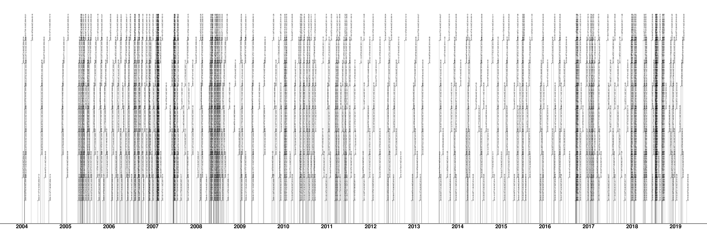
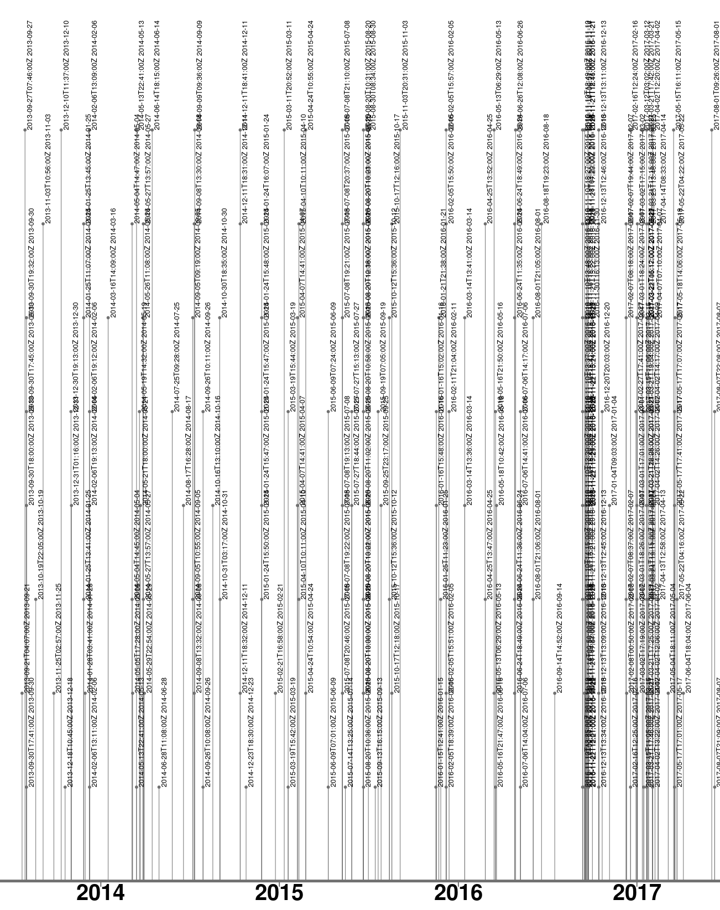

# Vergleichslog Versionsgeschichte und ZEIT-Korpus

[TOC]

Grundannahme: Kontroverse Begriffe zeichnen sich durch eine höhere Aufmerksamkeit aus, als allgemein anerkannte. Daraus folgt, dass ein kontroverses Thema häufiger in der Presse behandelt wird während ein kontroverses Lemma häufiger bearbeitet wird.

## Auswahl der zu Vergleichenden Bearbeitungsversionen

|                | Lemma Populismus in der Wikipedia                            | Begriff "Populismus" im ZEIT-Korpus             |
| -------------- | ------------------------------------------------------------ | ----------------------------------------------- |
| Datenbasis     | [20190627_Populismus_refined_full.csv](/div/20190627_Populismus_refined_full.csv) | [Auswertung_ZEIT.ods](/div/Auswertung_ZEIT.ods) |
| Visualisierung | - [20190627_Plot.png](/draft/20190627_Plot.png)  - [20190627_Plot_2014-2017.png](/draft/20190627_Plot_2014-2017.png) |                                                 |

### Zeitkorpus

Ermittelter Zeitraum Zeitkorpus: 2014 bis 2016 (jeweils in vollen Jahren)

- TODO: Sören: visualisieren

### Versionsgeschichte 

Vollständige Versionsgeschichte des Lemmas *Populismus*.

Versionsgeschichte von 2014 bis 2017. Phasen mit geringer Bearbeitungsfrequenz finden sich zu beginn des ausgewählten Zeitraumes im März 2014. Als Ausgangsversion bietet sich die Version vom 2014-03-16T14:09:00Z an (ID 128563967), da diese vereinzelt ist und in den Versionen zuvor nur Detailänderungen vorgenommen wurden. (Ab hier V2014 genannt.)

Als Vergleichsversion dient 2017-06-04T18:04:00Z (ID 166083456) da sie die letzte Änderung im Peak von Ende 2016/Anfang 2017 markiert und folgend nur kleine Änderungen vorgenommen wurden. (Ab hier V2017 genannt.) Die Auswahl eines Datums im Jahr 2017 widerspricht im ersten Augenblick der oben getroffenen Eingrenzung auf das Jahr 2016, jedoch ist die Auflösung der Daten im Korpusstatistiktool auf ganze Jahre begrenzt. Da eine genauere Auflösung der Korpusdaten aktuell nicht möglich ist wurde beschlossen, den Betrachtungszeitraum auf das Ende des o.g. Peaks zu erweitern.

Der Textvergleich dieser beiden Versionen kann über die [Wikipedia Revisionskontrolle](https://de.wikipedia.org/w/index.php?title=Populismus&type=revision&diff=166083456&oldid=128563967) vorgenommen werden. Die Adressierung der Versionen erfolgt dabei über eine generierte URL anhand der IDs.

### DiaCollo-Auswertung

Im Folgenden werden jene Begriffe aufgelistet, die zwischen 2014 (exkl.) bis einschließlich 2017 (s.o.) , in absteigender Häufigkeit der Wortpaarung (Indikator F12) und nach Jahren sortiert. Begriffen, die bereits zuvor als Kollokation aufgetreten sind, sind Jahr und Häufigkeit des letzten Auftretens in Klammern beigestellt. (gemäß [Auswertung_ZEIT.ods](/div/Auswertung_ZEIT.ods)) 

| Jahr |               Begriff               | F12  |
| :--: | :---------------------------------: | :--: |
| 2015 |          werfen (2014, 9)           |  8   |
|      |         politisch (2014, 9)         |  7   |
|      |          Europa (2013, 5)           |  7   |
|      |               billig                |  5   |
|      |                 AfD                 |  5   |
|      |               Tsipras               |  5   |
| 2016 |       Nationalismus (2013, 9)       |  14  |
|      |               Europa                |  12  |
|      |             Demokratie              |  11  |
|      |                 AfD                 |  11  |
|      |             Populismus              |  8   |
|      |              politisch              |  8   |
|      |               werfen                |  7   |
|      |               Politik               |  7   |
|      |   Christlich_Demokratische_Union    |  7   |
|      |               Merkel                |  7   |
|      |              Demagogie              |  6   |
|      |             demagogisch             |  6   |
|      |               Antwort               |  6   |
|      |              zunehmend              |  5   |
|      |                link                 |  5   |
|      |                Form                 |  5   |
|      |                recht                |  5   |
|      |               Gefahr                |  5   |
|      |               warnen                |  5   |
|      |               Problem               |  5   |
| 2017 |               Europa                |  18  |
|      |                recht                |  15  |
|      |              politisch              |  15  |
|      |                Zeit                 |  15  |
|      |             Demokratie              |  10  |
|      |                Frage                |  9   |
|      |                Volk                 |  9   |
|      |             Populismus              |  8   |
|      |                link                 |  8   |
|      | Frankreich ('französisch', 2013, 5) |  8   |
|      |                eigen                |  8   |
|      |              Aufstieg               |  7   |
|      |               Antwort               |  7   |
|      |               Liberal               |  7   |
|      |               Politik               |  6   |
|      |               finden                |  6   |
|      |                Welle                |  5   |
|      |            Gesellschaft             |  5   |
|      |            Ungleichheit             |  5   |
|      |              Bewegung               |  5   |

### Textvergleich

Folgende Unterschiede im Text der o.g. Versionen fallen unter Berücksichtigung der o.g. Begriffspaare auf:

| Begriff                           | V2014 | V2017 | Bemerkung                                                    |
| --------------------------------- | :---: | :---: | ------------------------------------------------------------ |
| AfD / Alternative für Deutschland |   0   |   1   | Taucht erstmalig in V2017 auf, im Abschnitt "Rechtspopulismus" |
| Demokratie                        |  12   |  26   | -                                                            |
| Europa                            |  21   |  21   | Keine signifikanten Unterschiede in Frequenz und Verwendung  |
| politisch                         |  32   |  49   | In V2017 taucht im Abschnitt "Sozialwissenschaft" die Idee des "politischen Populismus" auf, während in V2014 "politisch" nur zur Beschreibung des Umfeldes Dient |
| Politik                           |  33   |  40   | V2017 "teils auch um einen spezifischen Politikstil", neuer Abschnitt "Populismus als Strategie" im Kontext "Politik" |
| Merkel                            |   0   |   1   | V2017 "Angela Merkel mit ihrer 'Politik der Alternativlosigkeit' die Musterschülerin des (neo)liberalen Populismus" |
| Demagogie                         |   1   |   0   | In V2014 als Stichwort unter "Siehe auch"                    |
| recht                             |  54   |  58   | Tritt i.d.R. als politischer Bezeichner auf.                 |

