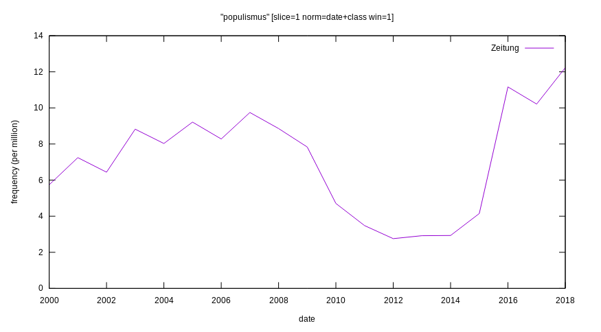

# Wikipedia-Versionsgeschichte als begriffshistorische Quelle am Beispiel des Artikels "Populismus"

---

Humboldt-Universität zu Berlin

11.07.2019

Titouan Morand, Sören Rampf, Stefan Krug 

---

[TOC]

---

## Begriffsdefinition "Populismus"

Note:

- Referent: Titouan

---

## Forschungsvorhaben

- Eruierung des Quellenwertes der Wikipedia Versionsgeschichte
  - Kontext Begriffsgeschichte
- Explorativer Umgang mit Mitteln der DH
  - Arbeit mit genuin digitalen Daten
  - Management von Forschungsprozessdaten via [github](https://www.github.com/krugbuild/wiki-pop-quelle)

Note:

- Überblick durch Stefan
- Kurzvorstellung/Verweis auf angenommenen Quellenwert
- Kurzvorstellung akademischer Anspruch (prozessdatenmanagement & open science) und Ansatz
  - github-Repositorium
  - Kooperative Nutzung & Teammanagement
  - Dokumentation & Publikation

---

## Zeitliche Rahmung via Korpusstatistik

Note:

- Referent: Sören

---

## Begriffliche Rahmung via Diacollo

Note:

- Referent: Sören

---

## Datenaufbereitung

- OpenRefine 3.2 beta
- Dokumentation via [Log File](../div/log.md)
- Ergebnis als [csv](../div/20190627_Populismus_refined_full.csv)

Note: 

- Referent: Stefan
- zukünftige Lösungsansätze:
  - Teilautomatisierung via Skript
  - automatisches logging
  - Formatierung im Detail abhängig von Weiterverarbeitung -> R
- Link zu `[OpenRefine]()`

---

## Visualisierung der Chronologie

- Plotting via R (RStudio)
- Häufung von Edits -> Begriffsfindung
- Abgleich der Chronologie mit Korpusstatistikauswertung

Note:

- Referent: Stefan
- Die Quellen zum Plotting finden sich im Verzeichnis [R_timeline_plot](../R_timeline_plot), das verwendete Paket heißt `[timelineS]()`

----

Note:

- Referent: Stefan
- Zeitstrahl mit regelmäßigen Abständen
- Häufung von Datenpunkten impliziert anhaltende Begriffsfindung
- Abschnitte mit wenigen Edits implizieren eine unumstrittene Begriffsdefinition

----

Note:

- Referent: Stefan
- Ausschnitt 2014 bis 2017
- Bestimmung "gesicherter" Versionen über eine visuelle Identifizierung unumstrittener Versionen
- 2014-03-16T14:09:00Z (ID 128563967)
- 2017-06-04T18:04:00Z (ID 166083456)

---

## Versionsvergleich

- via [Wikipedia Revisionskontrolle](https://de.wikipedia.org/w/index.php?title=Populismus&type=revision&diff=166083456&oldid=128563967)
- Prüfung auf via DiaCollo identifizierte Kollokationen (vgl. [VergleichsLog.md](../div/VergleichsLog.md))

---

CC_BY_SA

